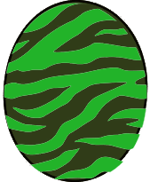

# Boltreaver Astalos

### Attack patterns
1. Normal - Technical
2. Flying - Speed
3. After flying - Power
4. Flying again - Speed

### Parts
1. Head - 
2. Body - 
3. Legs - 
4. Tail - 

### Element weakness
Fire 

### Egg pattern

Egg Tags: 