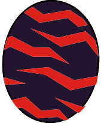

# Hellblade Glavenus

### Attack patterns
1. Normal - Power
2. After Mega Fireball Charge - Speed (~3 times)
   - Flame Chakram - Single target
   - Explosive Tail - All targets (will keep repeating until tail is broken)
3. After tail broken: Power

### Parts
1. Head - Slash 
2. Body - Blunt
3. Tail - Slash (Break for knockdown)

### Element weakness
Water

### Egg pattern

Egg Tags: black,red