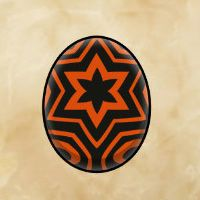

# Nergigante

## Attack patterns
1. Normal - Technical
2. White spikes - Power
    - Note: Attacks twice
    - Destroy all parts to trigger knockdown
3. Enraged - Speed

## Parts
1. Normal
    - No body part - Slash
2. White spikes
    - Legs - Slash
    - Head - Blunt
    - Wings - Slash

## Element weakness
Thunder

## Egg pattern
