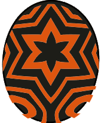

# Nergigante

### Attack patterns
1. Normal - Technical
2. White spikes - Power
    - Attacks twice
3. Enraged - Speed

### Parts
1. Normal
    - No body part - Slash
2. White spikes (Break all parts to trigger knockdown)
    - Legs - Slash
    - Head - Blunt
    - Wings - Slash

### Element weakness
Thunder

### Egg pattern

Egg Tags: 