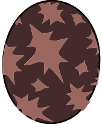

# Rajang

### Attack patterns
1. Normal - Power
2. After Technical Aura - Technical
    - Attacks twice
    - Thundercrack: All targets
3. After Technical Aura - Speed
    - Attacks twice
    - Mach Punch: Single target
  
!> Even if the Aura move is interrupted by Kinship skill, the attack pattern will still change!

### Parts
1. Head - Slash 
2. Body - Blunt
3. Legs - Slash
4. Tail - Slash

### Element weakness
Ice

### Egg pattern

Egg Tags: 