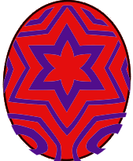

# Teostra

### Attack patterns
1. Normal - Speed
2. Enraged - Power
    - Firepowder: Single target, inflicts Blastblight
    - Dust Explosion: All targets, flies on next turn
3. Flying - Technical
    - Flare Storm: All targets, back to Normal next turn

### Parts
1. Head - Slash 
2. Stomach - ?
3. Tail - Slash
4. Wings - ?

### Element weakness
Water

### Egg pattern

Egg Tags: 